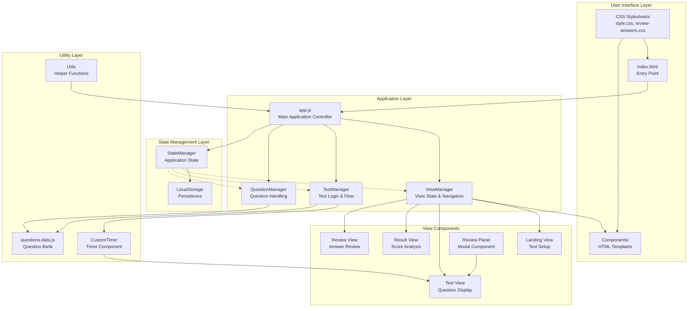
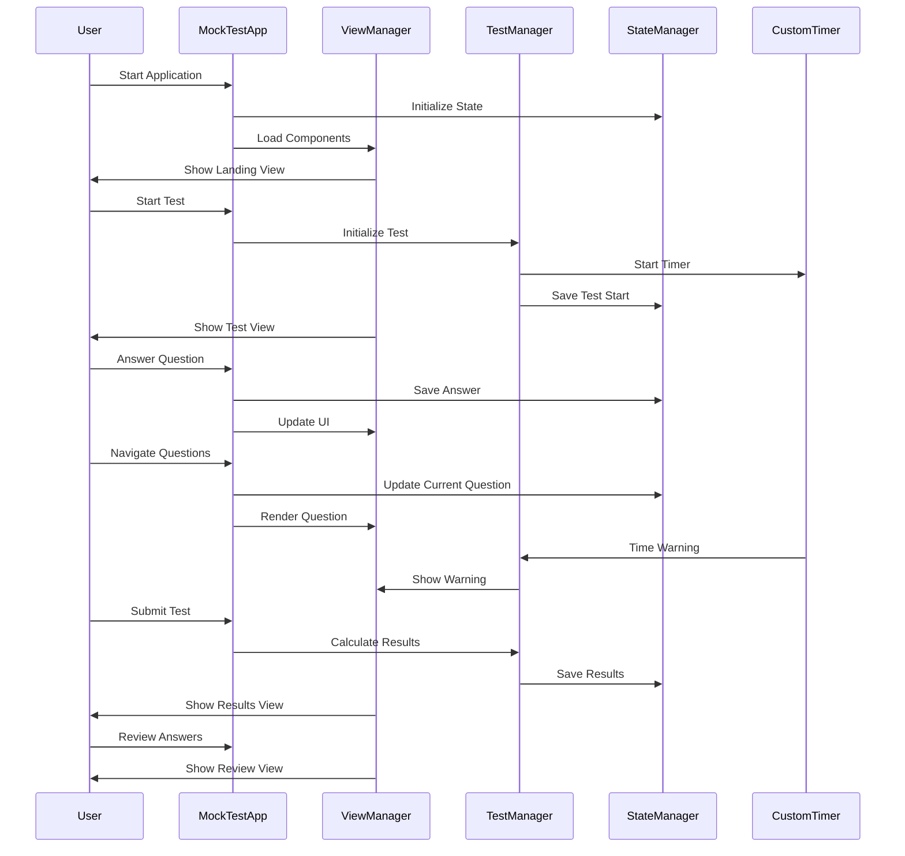
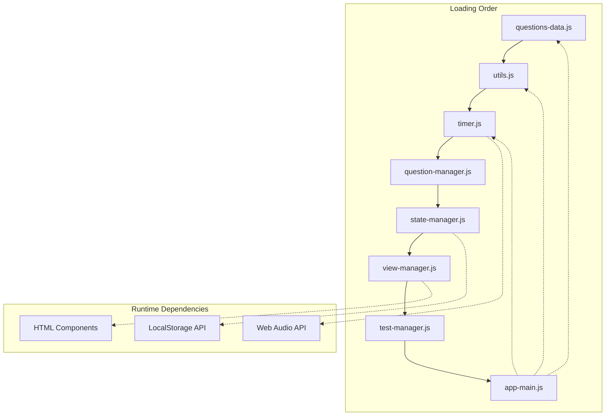

# Units & Measurements Mock Test - Architecture Overview

This document provides an architectural overview of the RRB Mock Test application for Units & Measurements, built with vanilla JavaScript, HTML, and CSS.

## System Architecture



## Component Architecture

```mermaid
graph LR
    subgraph "Core Components"
        A[MockTestApp<br/>Main Controller]
        B[ViewManager<br/>UI State Management]
        C[TestManager<br/>Test Logic]
        D[QuestionManager<br/>Question Handling]
        E[StateManager<br/>Data Persistence]
    end

    subgraph "UI Components"
        F[Landing View<br/>Test Configuration]
        G[Test View<br/>Question Interface]
        H[Result View<br/>Performance Analysis]
        I[Review View<br/>Answer Review]
        J[Review Panel<br/>Quick Navigation]
    end

    subgraph "Utilities"
        K[CustomTimer<br/>Time Management]
        L[Utils<br/>Helper Functions]
        M[Question Bank<br/>Data Source]
    end

    A --> B
    A --> C
    A --> D
    A --> E
    B --> F
    B --> G
    B --> H
    B --> I
    G --> J
    C --> K
    C --> M
    D --> M
    E --> LocalStorage[(LocalStorage)]
```



## Data Flow Architecture



## Module Dependencies



## Key Features & Capabilities

### 1. **Modular Architecture**
- Component-based design with clear separation of concerns
- Lazy loading of HTML components
- Dependency injection pattern

### 2. **State Management**
- Centralized state management with StateManager
- Persistent storage using LocalStorage
- State validation and recovery mechanisms

### 3. **Test Management**
- Comprehensive timer system with audio/visual alerts
- Question navigation and bookmarking
- Real-time answer tracking and validation

### 4. **User Interface**
- Responsive design with CSS custom properties
- Dark mode support
- Modal components for enhanced UX

### 5. **Performance Analytics**
- Topic-wise accuracy analysis
- Difficulty-based performance metrics
- Detailed question-wise breakdown

## Technology Stack

- **Frontend**: Vanilla JavaScript (ES6+)
- **Styling**: CSS3 with custom properties
- **Storage**: LocalStorage API
- **Audio**: Web Audio API
- **Charts**: Canvas-based rendering
- **Architecture**: Component-based modular design

## File Structure Overview

```
├── index.html              # Entry point
├── css/
│   ├── style.css          # Main styles
│   └── review-answers.css # Review component styles
├── js/
│   ├── app.js             # Main application
│   ├── view-manager.js    # View management
│   ├── test-manager.js    # Test logic
│   ├── question-manager.js # Question handling
│   ├── state-manager.js   # State management
│   ├── timer.js           # Timer component
│   ├── utils.js           # Utility functions
│   └── questions-data.js  # Question bank
└── components/
    ├── landing-view.html
    ├── test-view.html
    ├── result-view.html
    ├── review-answers-view.html
    └── review-panel.html
```

This architecture ensures scalability, maintainability, and optimal performance for the RRB Mock Test application focused on Units & Measurements.